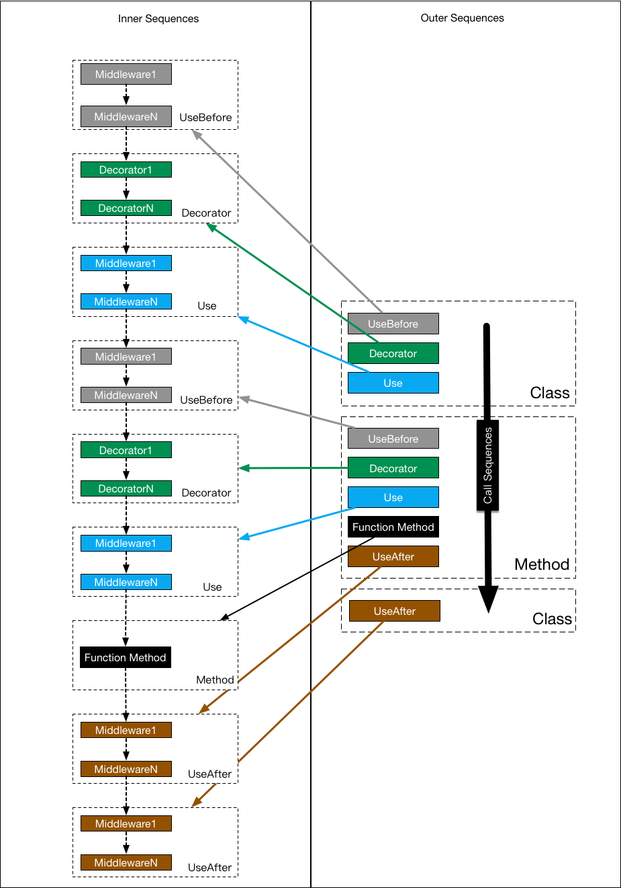

[schema]: https://github.com/OAI/OpenAPI-Specification/blob/master/versions/2.0.md#schema
[path-item-object]: https://github.com/OAI/OpenAPI-Specification/blob/master/versions/2.0.md#path-item-object
[operation-object]: https://github.com/OAI/OpenAPI-Specification/blob/master/versions/2.0.md#operation-object
[responses-object]: https://github.com/OAI/OpenAPI-Specification/blob/master/versions/2.0.md#responses-object
[parameter-object]: https://github.com/OAI/OpenAPI-Specification/blob/master/versions/2.0.md#parameter-object
[koa-router-api-reference]: https://github.com/alexmingoia/koa-router#api-reference

<!-- @import "[TOC]" {cmd="toc" depthFrom=1 depthTo=6 orderedList=false} -->
<!-- code_chunk_output -->

* [OreoRouter](#oreorouter)
	* [new OreoRouter(options)](#new-oreorouteroptions)
		* [选项参数](#选项参数)
	* [基本用法](#基本用法)
	* [更多功能](#更多功能)
* [Decorators](#decorators)
	* [Class Decorators](#class-decorators)
	* [Function Decorators](#function-decorators)
* [自定义装饰器](#自定义装饰器)
	* [使用toDecorator(options)](#使用todecoratoroptions)
		* [选项参数](#选项参数-1)
			* [middleware(...entryArgs)](#middlewareentryargs)
			* [beforeHandler(target, name, descriptor, constructor, decoratorName, ...entryArgs)](#beforehandlertarget-name-descriptor-constructor-decoratorname-entryargs)
			* [afterHandler(target, name, descriptor, constructor, decoratorName, ...entryArgs)](#afterhandlertarget-name-descriptor-constructor-decoratorname-entryargs)
	* [基本用法](#基本用法-1)
* [装饰器中间件的执行顺序](#装饰器中间件的执行顺序)

<!-- /code_chunk_output -->

# OreoRouter
**Kind**: Exported class

## new OreoRouter(options)
生成一个路由器。

### 选项参数
| Param                             | Type             | Required | Description                 |
| --------------------------------- | ---------------- | -------- | --------------------------- |
| options                           | Object           | true     |                             |
| options.prefix                    | String           | false    | 所有路由的前缀                     |
| options.api                       | Object           | false    | [OpenAPI2.0 Schema][schema] |
| options.apiExplorerEnable         | Boolean          | false    | 启用api-explorer, 默认**true**  |
| options.internalDecoratorHandlers | Object           | true     | 装饰器中间件包装器                   |
| options.middleware                | [String\|Object] | true     | 接口类目录，或者接口类选项               |
| options.middleware.dir            | String           | true     | 接口类目录                       |
| options.middleware.include        | [String\|Regex]  | false    | 目录白名单                       |
| options.middleware.exclude        | [String\|Regex]  | false    | 目录黑名单                       |
| options.middleware.recurse        | Boolean          | false    | 递归遍历目录, 默认**true**          |

## 基本用法
```js
import Koa from 'koa';
import {OreoRouter} from 'oreo-router';

const app = new Koa();
const router = new OreoRouter({
...
});

app.use(router.routes());
app.use(router.allowedMethods());

app.listen(3000);
```

## 更多功能
更多功能请阅读文档[koa-router][koa-router-api-reference]。

# Decorators
我们内置了大部分作为一个Router所需的装饰器。装饰器分为类的装饰器和类的方法装饰器，每种装饰器只可以装饰指定类型的对象，不过有一些既可以装饰类又可以装饰方法，比如**UseBefore**,**Use**,**UseAfter**。

## Class Decorators
| Decorator Name                     | Target | Deocrate(min/max) | Description                       |
| ---------------------------------- | ------ | ----------------- | --------------------------------- |
| `@Middleware(routePrefix: string)` | class  | **1**/1               | 将该类标记为一个业务接口类，并设置一个路由前缀应用于所有接口方法。 |
| `@UseBefore(middle: KoaMiddle)`    | class  | 0/**Infinity**              | 将中间件挂载到类的头部。                      |
| `@Use(middle: KoaMiddle)`          | class  | 0/**Infinity**              | 将中间件挂载到类的装饰器之后。                   |
| `@UseAfter(middle: KoaMiddle)`     | class  | 0/**Infinity**              | 将中间件挂载到类的尾部。                      |

## Function Decorators
**Get**,**Post**,**Patch**,**Put**,**Delete**为一组装饰器，必须使用其中任意一个装饰器装饰要暴露的成员方法。

| Decorator Name          | Target   | Deocrate(min/max) | Description                              |
| ----------------------- | -------- | ----------------- | ---------------------------------------- |
| `@Get(string)`          | function | 0/1               | 子路径为route的GET接口，详情：[path-item-object][path-item-object] |
| `@Post(string)`         | function | 0/1               | 子路径为route的POST接口，详情：[path-item-object][path-item-object] |
| `@Put(string)`          | function | 0/1               | 子路径为route的PUT接口，详情：[path-item-object][path-item-object] |
| `@Patch(string)`        | function | 0/1               | 子路径为route的PATCH接口，详情：[path-item-object][path-item-object] |
| `@Delete(string)`       | function | 0/1               | 子路径为route的DELETE接口，详情：[path-item-object][path-item-object] |
| `@Summary(string)`      | function | 0/1               | 摘要信息，详情： [operation-object][ operation-object] |
| `@Description(string)`  | function | 0/1               | 描述信息，详情： [operation-object][ operation-object] |
| `@Tags([string])`       | function | 0/1               | 标签信息，详情：[operation-object][ operation-object] |
| `@Consumes([string])`   | function | 0/1               | 请求参数数据格式，详情：[operation-object][ operation-object] |
| `@Produces([string])`   | function | 0/1               | 响应结果数据格式，详情：[operation-object][ operation-object] |
| `@Schemes([string])`    | function | 0/1               | 传输协议，详情：[operation-object][ operation-object] |
| `@Deprecated(boolean)`  | function | 0/1               | 废弃接口，详情：[operation-object][ operation-object] |
| `@Security()`           | function | 0/1               | 安全要求，详情：[operation-object][ operation-object] |
| `@Query(object)`        | function | 0/1               | query请求参数描述，详情：[parameter-object][parameter-object] |
| `@Param(object)`        | function | 0/1               | param请求参数描述，详情：[parameter-object][parameter-object] |
| `@Body(object)`         | function | 0/1               | body请求参数描述，详情：[parameter-object][parameter-object] |
| `@FormData(object)`     | function | 0/1               | formData请求参数描述，详情：[parameter-object][parameter-object] |
| `@Header(object)`       | function | 0/1               | header请求参数描述，详情：[parameter-object][parameter-object] |
| `@Response(object)`     | function | **1**/1               | 响应结果描述，详情：[responses-object][ responses-object] |
| `@UseBefore(KoaMiddle)` | function | 0/**Infinity**              | 挂载中间件到方法头部                               |
| `@Use(KoaMiddle)`       | function | 0/**Infinity**              | 挂载中间件到方法之前                               |
| `@UseAfter(KoaMiddle)`  | function | 0/**Infinity**              | 挂载中间件到方法尾部                               |

# 自定义装饰器
根据选项参数生成一个装饰器，注意：装饰器的名称不可以重复。

## 使用toDecorator(options)
### 选项参数
| Param                 | Type     | Required | Description                      |
| --------------------- | -------- | -------- | -------------------------------- |
| options               | Object   | true     |                                  |
| options.name          | String   | true     | 装饰器名称，全局唯一                       |
| options.middleware    | Function | true     | 中间件包装器                           |
| options.beforeHandler | Function | false    | 在注册装饰器之前处理一些自定义业务                |
| options.afterHandler  | Function | false    | 在注册装饰器之后处理一些自定义业务                |
| options.targetType    | String   | false    | 装饰目标的类型any,class,function，默认any  |
| options.group         | String   | false    | 装饰器分组名称，可将多个装饰器归为一组。默认使用装饰器的name |
| options.minDecorate   | Integer  | false    | 限制group内的装饰器装饰单个类或者方法的最小次数，默认0   |
| options.maxDecorate   | Integer  | false    | 限制group内的装饰器装饰单个类或者方法的最大次数，默认1   |

#### middleware(...entryArgs)
* ...entryArgs 使用该装饰器装饰时输入数据

**必须返回一个中间件函数**

#### beforeHandler(target, name, descriptor, constructor, decoratorName, ...entryArgs)
* target 装饰的目标
* name 装饰方法的名称，当装饰类的时候为**undefined**
* descriptor 描述对象
* constructor 装饰目标的构造函数
* decoratorName 装饰器名称
* ...entryArgs 使用该装饰器装饰时输入数据

#### afterHandler(target, name, descriptor, constructor, decoratorName, ...entryArgs)
* target 装饰的目标
* name 装饰方法的名称，当装饰类的时候为**undefined**
* descriptor 描述对象
* constructor 装饰目标的构造函数
* decoratorName 装饰器名称
* ...entryArgs 使用该装饰器装饰时输入数据

## 基本用法
```js
import { toDecorator } from 'oreo-router';

export default toDecorator({
  name: 'Log',
  targetType: 'function',
  maxDecorate: 1,
  middleware: (label) => {
    return async (ctx, next) => {
      const path = ctx.path;
      const method = ctx.method;

      console.log(`${label} -> ${new Date().toISOString()} ${method} ${path}`);

      await next();

      console.log(`${label} <- ${new Date().toISOString()} ${method} ${path}`);
    };
  },
});
```

# 装饰器中间件的执行顺序
一图胜千言。如果不明白，请再看一遍：）

